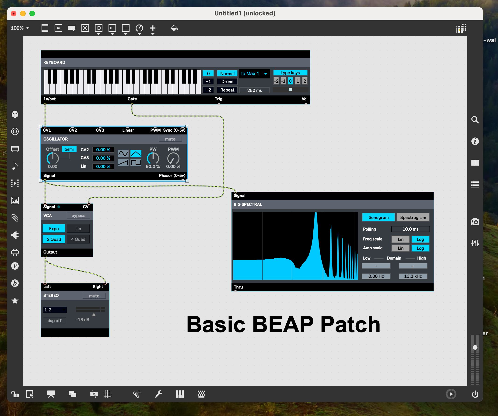
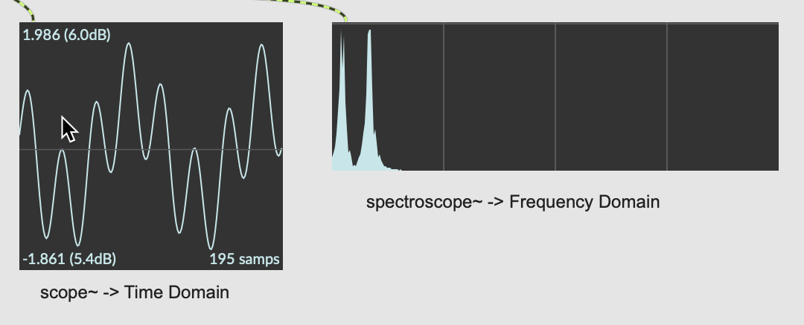
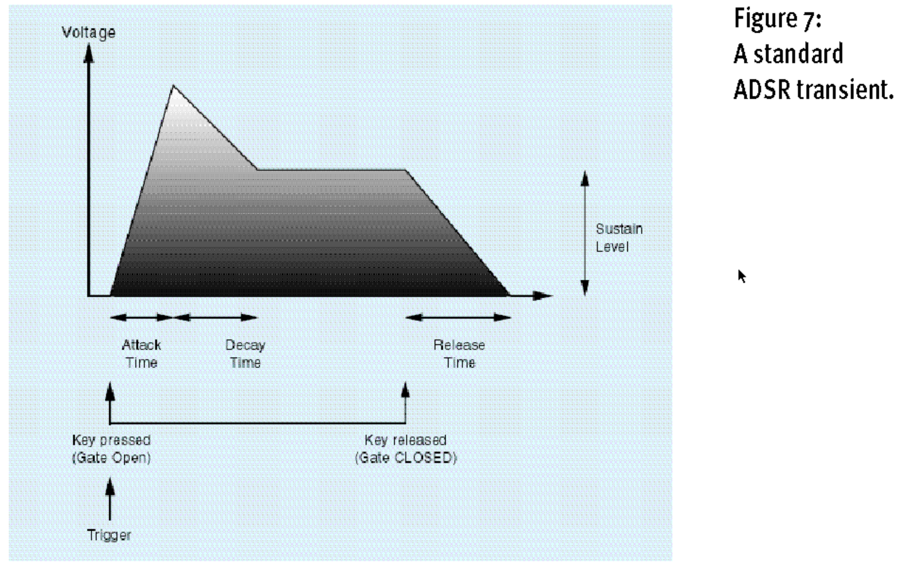
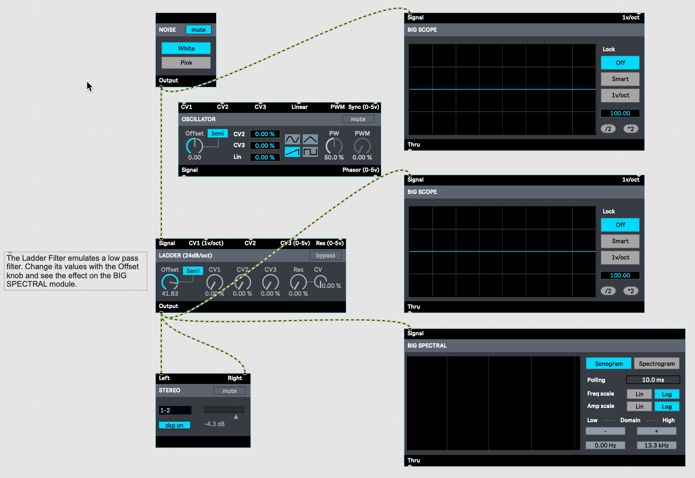
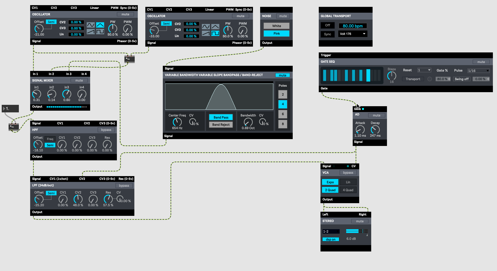

# Synthesizing of Sound

## Overview

Today we will use BEAP, these are modules build of MAX/MSP objects, that allow for an easier access to synthesising sound.



If you want to get a quick introduction, look at this [tutorial](https://cycling74.com/tutorials/beap-analog-model-curriculum-outline). There is also a more in depth series [A few minutes with BEAP](https://www.youtube.com/playlist?list=PLasl9I6VeCCoT_BfdZjD1AM6McGTQj7mK) or [A few minutes of BEAP on MAX website](https://cycling74.com/tutorials/a-few-minutes-with-beap-tutorial-series) you may want to watch and try out. 

Ableton's [Learning Synth](https://learningsynths.ableton.com/) is another source of knowledge if you want to leearn more about synthesising sound. You find some more information on that website at the end of this post.


## Overview

When describing how to synthesize sound, we normally use two representations of sound, the time domain and the frequency domain. They are different views on the same signal ([Domains](https://elvers.us/perception/soundWave/)). The two main ways to form a sound signal are envelope and filter. 

The envelope can be visualised using a graph in the time domain, you basically form the amplitudes. Patch 1 demonstrates how this happens.

The filter are best visualised with a graph in the frequency domain, as you are filtering out/suppressing unwanted frequencies. This is demonstrated in Patch 2 here. 



This post also introduces noise as another basic sound you can use to synthezise your sound. See Patch 2 how to do this.

The Patches 3 and 4 are then actual synthezisers you can play with.

Pathces 5 and 6 use again MAX/MSP, one is a synthezised light saber (STAR WARS), the other is another patch to visualise how to oscillator signals can be blended and what happens in the time and frequency domain.


### Patches to demonstrate some aspects of theory

#### 1. BEAP V4 Envelope Tester.maxpat - Get to Know an Envelope

This patch allows you to see the effect of an envelope on the sound. Change the parameters for Attack, Decay, Sustain and Release on the ADSR module.


The following diagram is taken from the article [Envelops, Gates and Triggers](https://www.soundonsound.com/techniques/envelopes-gates-triggers) and explains in a visual way how the four parameters are shaping the envelope of a signal.




#### 2. 221130LadderWithNoise

This patch introduces noise and filters.

So far, we have used oscillators to generate the basic sounds. But we can also use noise as a foundation to generate our sound. Noise is this hissing  you sometimes hear on an AM or FM radio when you are in between stations. It is actually a blend of many different frequencies. This patch has a noise generator and also has scope and spectral displays to show what is happening.

Furthermore, the patch also contains a *low pass filter* or *LPF* that only lets pass low frequencies and suppresses higher frequencies. The cut-off frequency can be adjusted with the Offset knob. You see the resulting noise on the spectral graph.




#### 3. 221129_FM_Brass_2_4.maxpat - Basic syntheziser


You can save your parameter settings by opening the Snapshot (blue camera icon on the left, see zoomed in image) and then click on new in the list that will open up. You can retrieve snapshots by right-clicking on the item you want to have.


#### 4. Rhythm with Drum Sequencer - Vid8c BEAP.maxpat



This patch tries to emulate the sound of a drum. It incorporates two oscillators and noise, all mixed and refined. There are also two filters that allow you to tweak the signal further. A trigger module allows you then to set the rhythm of your sound. The triggers are also passed through an attack-decay gate so that you can form the sound further.

**IMPORTANT:** Do not forget to activate the `Global Transport` by clicking on the button at the left bottom of the MAX window, beside the `Audio ON/OFF`.


#### 5. 221129 LightSaberV1.maxpat - A Star Wars Sound

The patch is rather complex, save it on your computer before playing around with the parameters. You need to start it by pressing the button, switch on the loudspeaker by pressing the object at the bottom and increase the gain on the slider. Then try out different values in the number boxes.


#### 6. 221129TwoOscillators1.maxpat - Two oscillators

This patch allows you to see what happens if you have two oscillators running at the same time. Interesting is in particular the case when the frequency of osciallator 1 is nearly equal to that of oscillator 2. Try it out.

**Challenge:** With some modifications to this patch you can also simulate a LFO (low frequency oscillator. For this you need to replace the ```+~``` Object with a ```*~``` Object and modify the scale object to give smaller values for the frequency (```scale 0 127 0 20```). Save the existing patch and then make the changes in the duplicate.


#### Learning Synths Website

An easy way to learn about sound synthesis is to follow the learning path on [Learning Synth](https://learningsynths.ableton.com/).


Here is a list of all subjects covered. You can either go through the course page by page, or just skim through the course and choose on that menu the things you want to learn about. Please get an idea before you tackle the ```Recipes``` and ```Playground```. In these sections you can assemble/synthesise your own sounds.

#### The ```Playground``` ...
... also allows you to make an audio recording of your work and save the file on your computer.

<a target="_blank" href="https://learningsynths.ableton.com/en/playground">
  
</a>

##### The left column of the interface gives you plenty of possibilities:
1. Record - You can record a clip of up to 60 seconds. When you stop the recording, a wav file will be saved on your computer. You can play it in MAX with the following simple patch:


2. Export - You can export your clip to a Digital Audio Workstation (DAW) to create your own multitrack song.
3. Sequence - Choose on one of the sequences available (drop-down menu under "Sequence" and then change the settings in the other columns and see what happens
4. Presets - The drop-down menu sets the synthesiser with many of the sounds/instruments introduced earlier in the course.
5. Keyboard - You can also play notes (pitch) with the keyboard. You can only use either the keyboard or the sequencer.

A synthesiser is a very powerful tool to create sounds. The Playground gives you audible and visible feedback on what you are doing. Pay attention to the pointers given, in particular the black points with the envelops. If a black point does not reach the end of the envelope, you should normally shorten the ADSR values. In order to understand what happens, first change one group of parameters and observe what happens. Next reset the values of the first group and proceed accordingly with all groups. In this way you get a better understanding on what heppens and can then afterwards truly synthesise your sounds.


## Further Materials
- [Cycling'74 blog post about how to create the sound for the lightsaber](https://cycling74.com/forums/lightsaber-inspired-sound)
- [A History of Synths in Cinema: Recreating Famous Sounds with eDNA Earth](https://youtu.be/AyXP4dOQsG0)
- [Sound Clips out of Daily Life](https://www.soundsofchanges.eu/?s=police) - You can use these clips as a model to synthesise the (simple) sounds with the tools here available. Furthermore, you can download the wav files and then use them with the playlist~ object inside your patches.
- [Telephone - Change to dial service in 1936, video with some signals for telephones](https://laughingsquid.com/1936-att-introduction-to-rotary-dial-telephones/)

##### Change History
- 221129 Original version on mibrs.github.io
- 240220 Revised content
