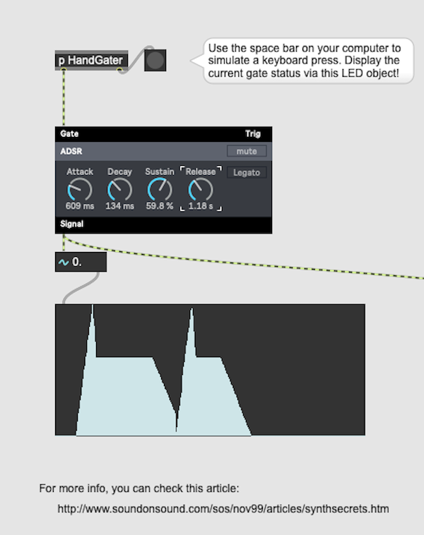
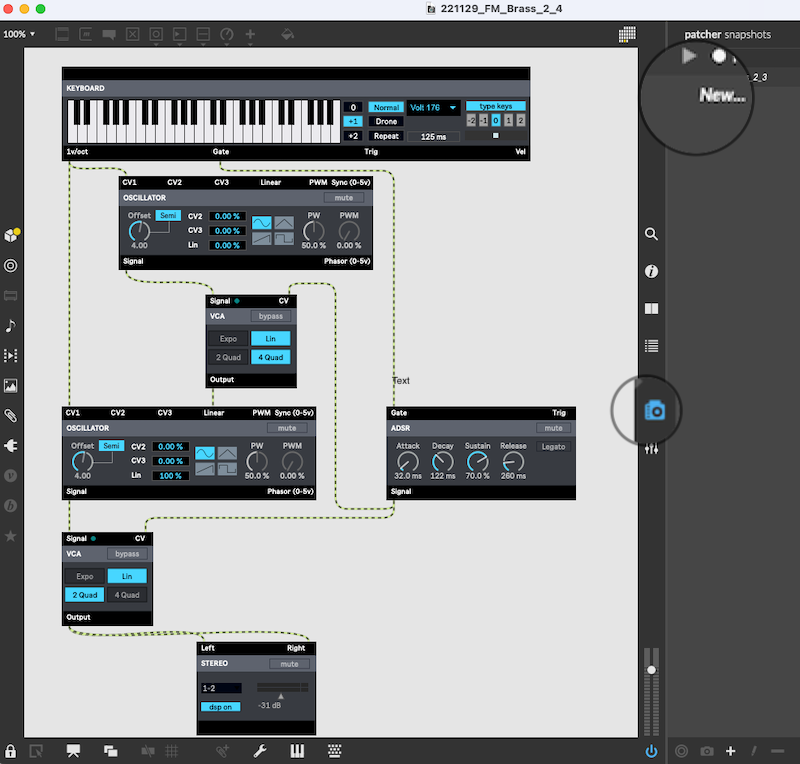
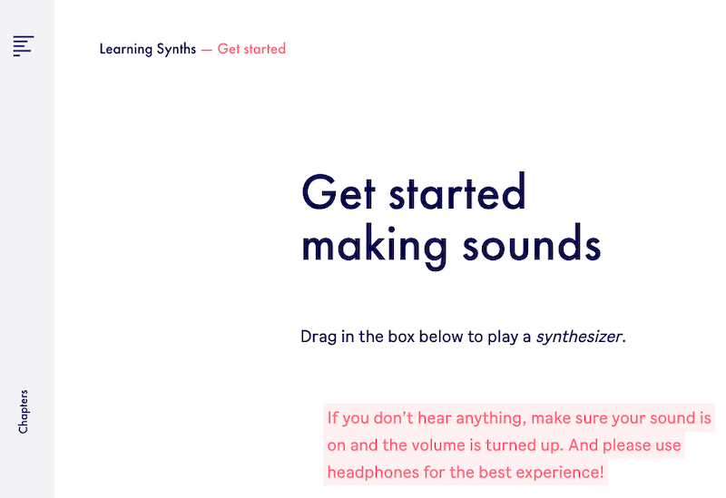
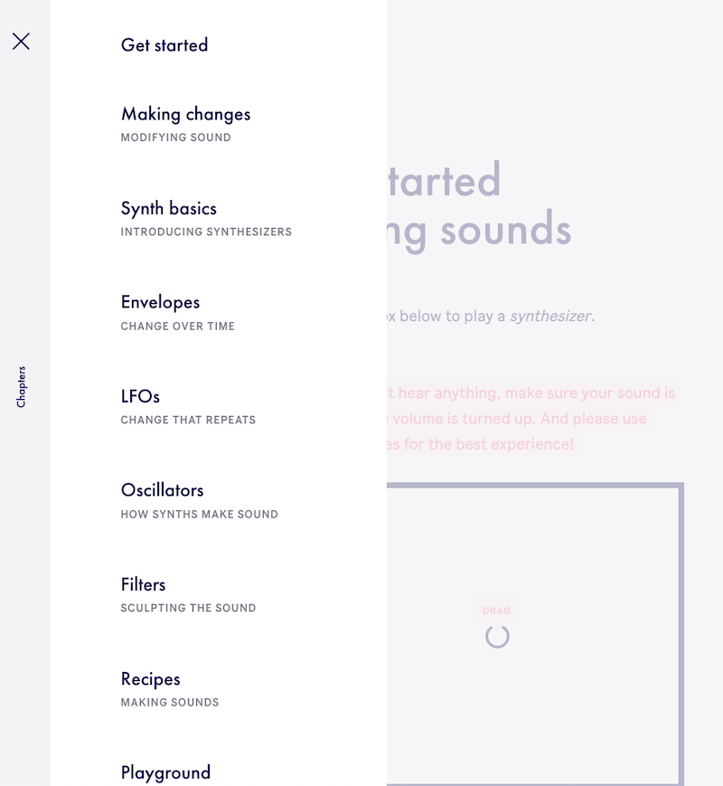
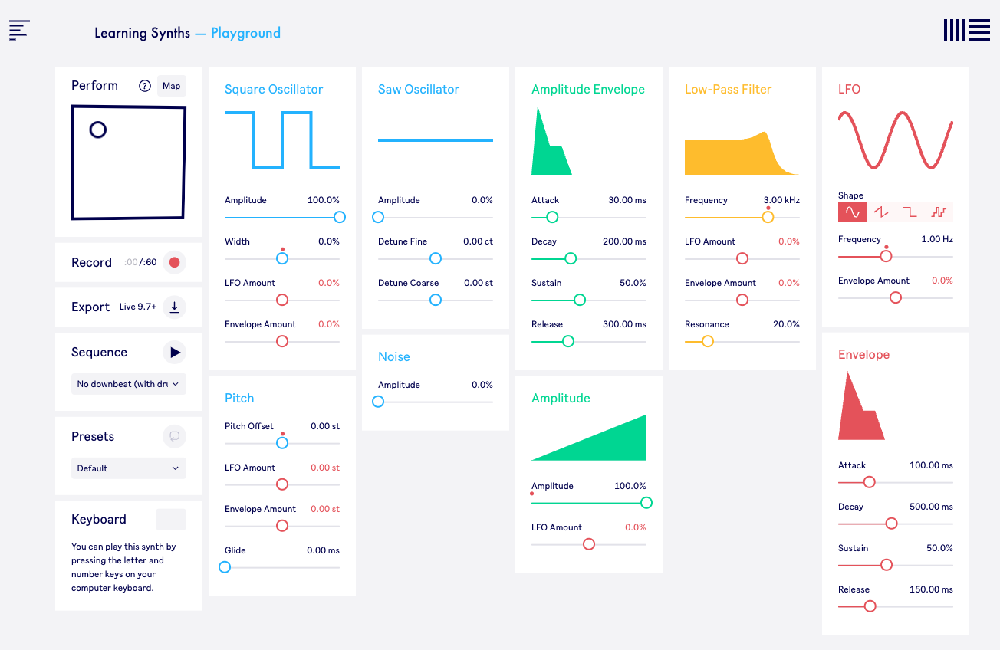
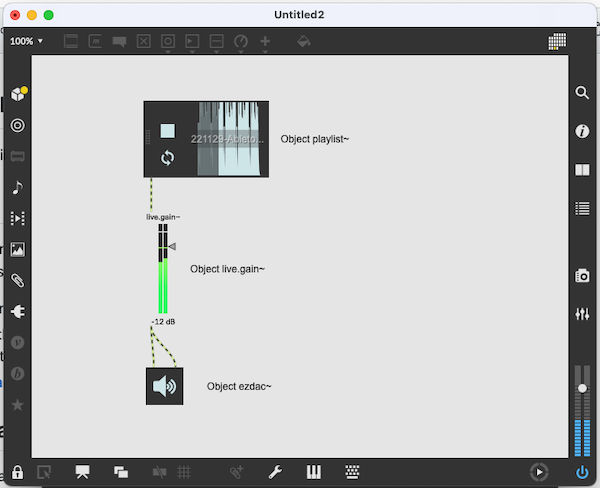

# Synthesing of Sound and Music

Materials for session on 29.11.22

## Overview
Today you will learn more about synthesing of sound and music. We will use three tools, all of them are using Cycling'74's MAX at their core. The tools are:
1. MAX/MSP core objects
2. MAX/MSP with BEAT modules (the modules are built with MAX/MSP, but the complexity is hidden and you only see the user interface to change the parameters as frequency, filter settings, and more.
3. Ableton's [Learning Synth](https://learningsynths.ableton.com/). The audio modules used on this website are also created with MAX.

## In More Detail

### Patches in the repository
##### BEAP V4 Envelope Tester.maxpat - Get to Know an Envelope
This patch allows you to see the effect of an envelope on the sound. Change the parameters for Attack, Decay, Sustain and Release on the ADSR module.



##### 221129_FM_Brass_2_4.maxpat - Basic syntheziser


You can save your parameter settings by opening the Snapshot (blue camera icon on the left, see zoomed in image) and then click on new in the list that will open up. You can retrieve snapshots by right-clicking on the item you want to have.

##### 221129 LightSaberV1.maxpat - A Star Wars Sound
The patch is rather complex, save it on your computer before playing around with the parameters. You need to start it by pressing the button, switch on the loudspeaker by pressing the object at the bottom and increase the gain on the slider. Then try out different values in the number boxes.

##### 221129TwoOscillators1.maxpat - Two oscillators
This patch allows you to see what happens if you have two oscillators running at the same time. Interesting is in particular the case when the frequency of osciallator 1 is nearly equal to that of oscillator 2. Try it out.

**Challenge:** With some modifications to this patch you can also simulate a LFO (low frequency oscillator. For this you need to replace the ```+~``` Object with a ```*~``` Object and modify the scale object to give smaller values for the frequency (```scale 0 127 0 20```). Save the existing patch and then make the changes in the duplicate.


#### Learning Synths Website

An easy way to learn about sound synthesis is to follow the learning path on [Learning Synth](https://learningsynths.ableton.com/).





Here is a list of all subjects covered. You can either go through the course page by page, or just skim through the course and choose on that menu the things you want to learn about. Please get an idea before you tackle the ```Recipes``` and ```Playground```. In these sections you can assemble/synthesise your own sounds.

#### The ```Playground``` ...
... also allows you to make an audio recording of your work and save the file on your computer.

<a target="_blank" href="https://learningsynths.ableton.com/en/playground">
  
</a>

##### The left column of the interface gives you plenty of possibilities:
1. Record - You can record a clip of up to 60 seconds. When you stop the recording, a wav file will be saved on your computer. You can play it in MAX with the following simple patch:



2. Export - You can export your clip to a Digital Audio Workstation (DAW) to create your own multitrack song.
3. Sequence - Choose on one of the sequences available (drop-down menu under "Sequence" and then change the settings in the other columns and see what happens
4. Presets - The drop-down menu sets the synthesiser with many of the sounds/instruments introduced earlier in the course.
5. Keyboard - You can also play notes (pitch) with the keyboard. You can only use either the keyboard or the sequencer.

A synthesiser is a very powerful tool to create sounds. The Playground gives you audible and visible feedback on what you are doing. Pay attention to the pointers given, in particular the black points with the envelops. If a black point does not reach the end of the envelope, you should normally shorten the ADSR values. In order to understand what happens, first change one group of parameters and observe what happens. Next reset the values of the first group and proceed accordingly with all groups. In this way you get a better understanding on what heppens and can then afterwards truly synthesise your sounds.


## Further Materials
- [Cycling'74 blog post about how to create the sound for the lightsaber](https://cycling74.com/forums/lightsaber-inspired-sound)
- [A History of Synths in Cinema: Recreating Famous Sounds with eDNA Earth](https://youtu.be/AyXP4dOQsG0)
- [Sound Clips out of Daily Life](https://www.soundsofchanges.eu/?s=police) - You can use these clips as a model to synthesise the (simple) sounds with the tools here available. Furthermore, you can download the wav files and then use them with the playlist~ object inside your patches.
- [Telephone - Change to dial service in 1936, video with some signals for telephones](https://laughingsquid.com/1936-att-introduction-to-rotary-dial-telephones/)
